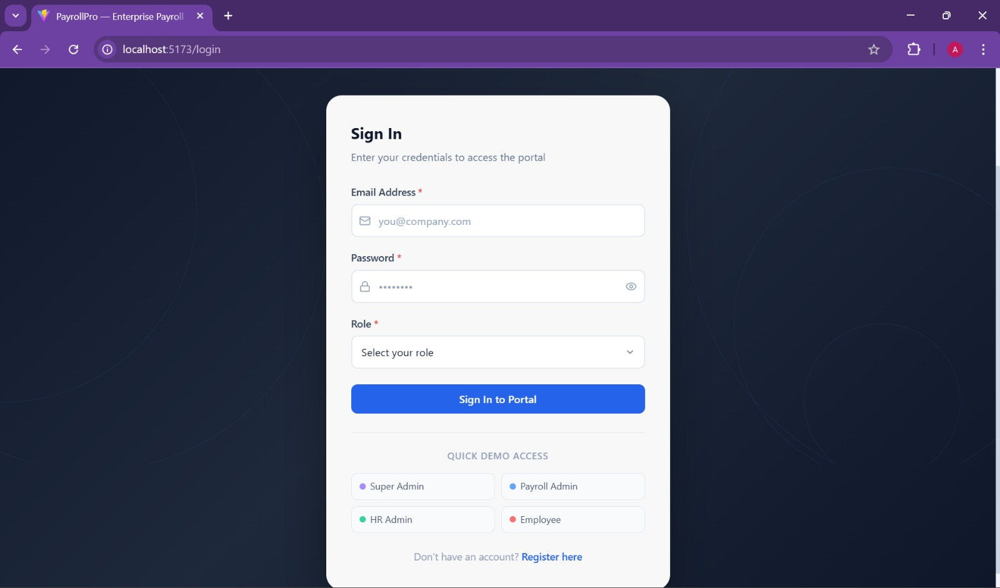
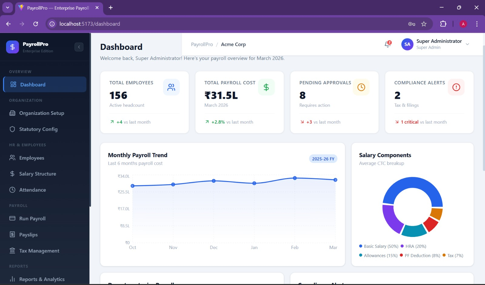
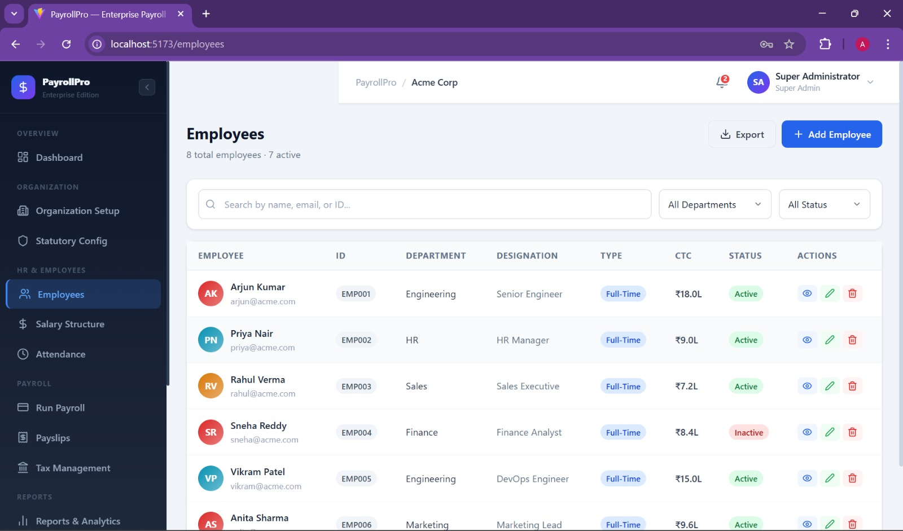
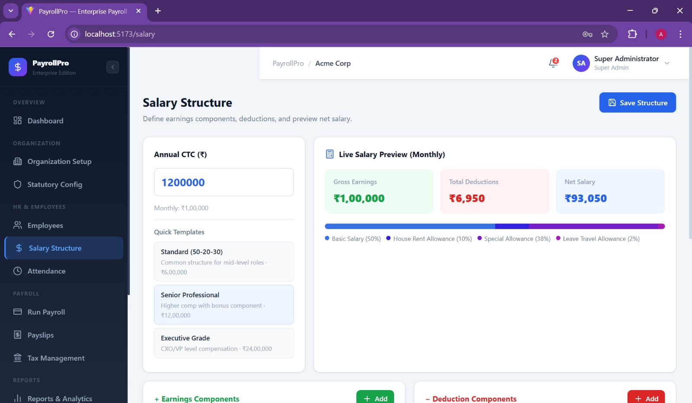
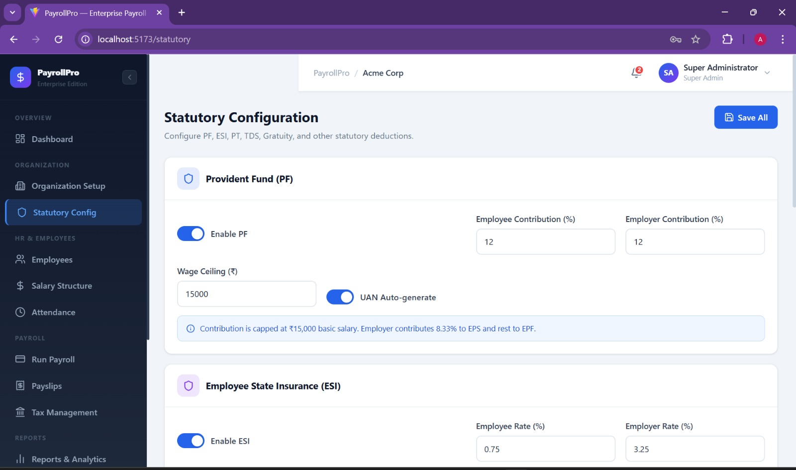
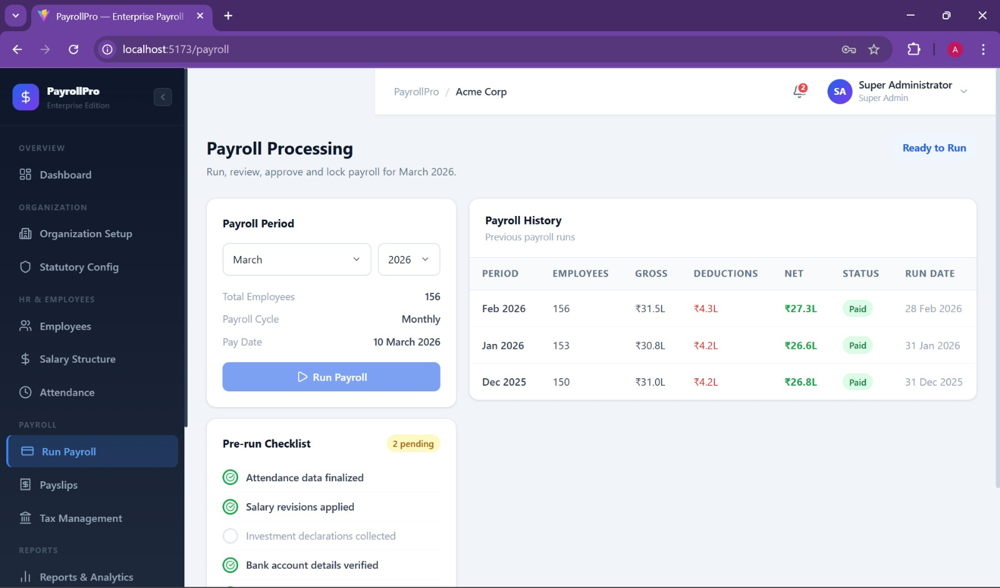
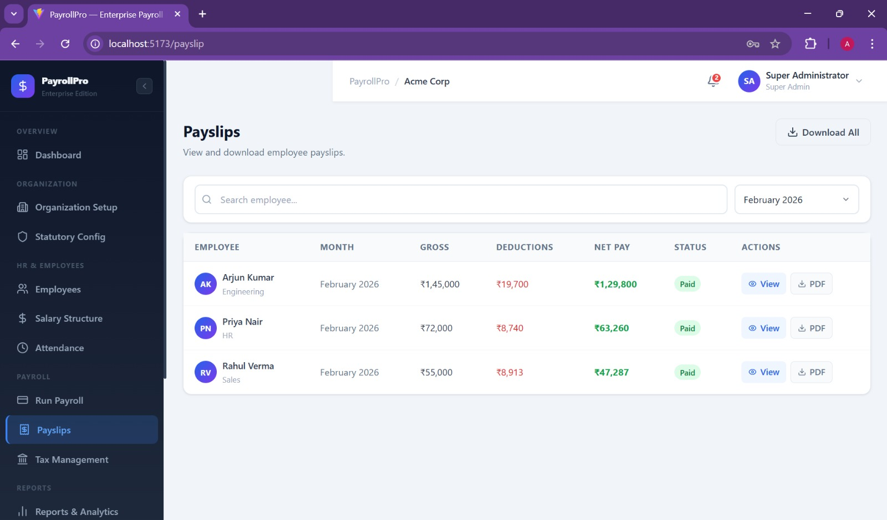
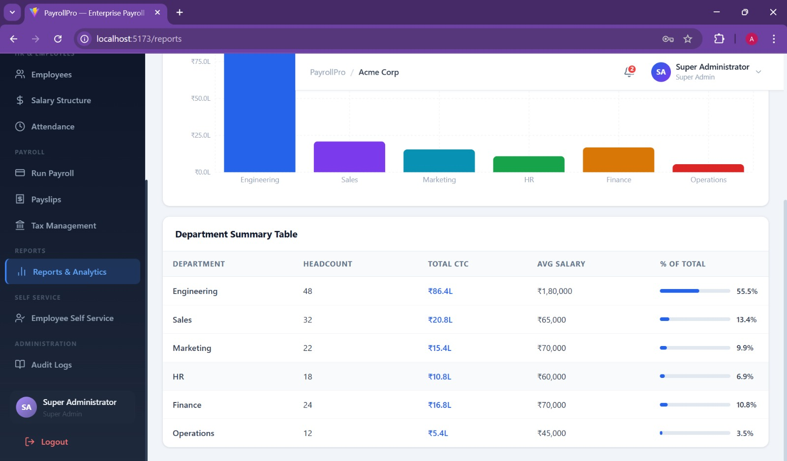

# 🚀 PayrollPro – Enterprise Payroll Management System

PayrollPro is a **full-stack enterprise payroll management platform** designed to automate employee payroll processing, salary management, statutory compliance, and payroll analytics.

The platform provides **secure authentication, role-based access control, payroll automation, statutory deductions configuration, and detailed reporting** — making payroll processing efficient and scalable for organizations.

This project was built using the **MERN Stack (MongoDB, Express.js, React.js, Node.js)** with a modular backend architecture and a modern responsive frontend interface.

---

# 🧠 Project Overview

Managing payroll manually can be complex and error-prone. PayrollPro simplifies this by providing a centralized platform where organizations can:

• Manage employees
• Configure statutory deductions
• Generate payroll automatically
• Produce payslips and reports
• Track payroll history

The system is designed to simulate **real enterprise payroll workflows** used in modern organizations.

---

# 🛠 Tech Stack

## Frontend

* React.js
* Vite
* Tailwind CSS
* Axios
* Modern Dashboard UI

## Backend

* Node.js
* Express.js
* MongoDB
* Mongoose
* JWT Authentication
* RESTful APIs

## Database

* MongoDB

---

# ✨ Core Features

## 🔐 Authentication & Role Based Access

Secure login system with multiple user roles:

* **Super Admin**
* **Payroll Admin**
* **HR Admin**
* **Employee**

Each role has **restricted access to specific modules**.

---

# 🏢 Organization Management

* Organization setup
* Configure payroll environment
* Manage company payroll policies

---

# 👥 Employee Management

* Add and manage employees
* Update employee information
* Employee salary structure management
* Employee self-service access

---

# 💰 Salary Structure Management

* Define salary components
* Manage allowances and deductions
* Configure salary breakdown

---

# ⚙️ Statutory Configuration

Supports configuration of statutory deductions including:

* Provident Fund (PF)
* Employee State Insurance (ESI)
* Professional Tax
* Income Tax rules

---

# 🧾 Payroll Processing

* Run monthly payroll
* Automated salary calculations
* Manage deductions and bonuses
* Generate payroll records

---

# 📄 Payslip Generation

* Automatic payslip generation
* Detailed salary breakdown
* Downloadable payslips

---

# 📊 Reports & Analytics

* Payroll reports
* Audit logs
* Payroll insights
* Employee salary summaries

---

# 🖼 Project Screenshots

## 🔑 Login Page



## 📊 Dashboard



## 👥 Employee Management



## 💰 Salary Structure



## ⚙️ Statutory Configuration



## 💳 Run Payroll



## 🧾 Payslips



## 📈 Reports



---

# 📂 Project Structure

```
Payroll-management-system
│
├── assets
│   ├── Login_Page.jpeg
│   ├── Dashboard-1.jpeg
│   ├── Employee_page.jpeg
│   ├── Payslips.jpeg
│   ├── Reports.jpeg
│
├── backend
│   ├── config
│   ├── controllers
│   ├── middleware
│   ├── models
│   ├── routes
│   ├── utils
│   └── server.js
│
├── frontend
│
├── .env
├── package.json
└── README.md
```

---

# ⚙️ Installation & Setup

## 1️⃣ Clone the Repository

```
git clone https://github.com/Asifa007/Payroll-management-system.git
```

```
cd Payroll-management-system
```

---

# Backend Setup

```
cd backend
npm install
```

Create a `.env` file:

```
PORT=5000
MONGO_URI=mongodb://localhost:27017/payroll_db
JWT_SECRET=your_secret_key
```

Run backend server:

```
npm run dev
```

---

# Frontend Setup

```
cd frontend
npm install
npm run dev
```

Frontend runs on:

```
http://localhost:5173
```

---

# 🗄 Database Collections

MongoDB stores the following collections:

* users
* employees
* payrolls
* payslips
* organizations
* auditlogs
* notifications

---

# 👩‍💻 Contributors

## Backend Development

**Asifa Firdhouse**

Responsibilities:

* Backend architecture
* REST API development
* MongoDB database schema design
* Authentication & authorization
* Payroll processing logic

---

## Frontend Development

**Savita**

Responsibilities:

* UI/UX design
* React frontend development
* Dashboard components
* Backend API integration

---

# 🚀 Future Enhancements

* Email notifications
* Payslip PDF export
* Multi-organization support
* Advanced payroll analytics
* Mobile responsive improvements

---

# 📜 License

This project is licensed under the **MIT License**.

You are free to use, modify, and distribute this software with proper attribution.

---

# 👤 Author

**Asifa Firdhouse**
Artificial Intelligence & Machine Learning Student
Backend Developer

GitHub: https://github.com/Asifa007
